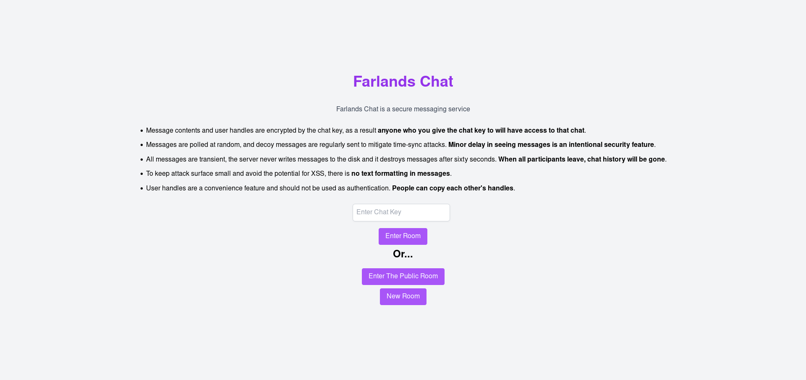

Farlands Chat
===

Farlands chat is a secure chat service. The client is written in Vue3 and the backend uses Koa. My goal with this project was to create a secure messaging platform that was very easy to use securely & anonymously, allowed for group chatting functionality and exposed the host to minimal legal risk.

ChatKeys are used to encrypt communication. They're comprised of a chat id, followed by a hash then a chat secret. The chat id is used to identify the particular chatroom, while the chat secret is used to symmetrically encrypt the communication of everyone in that chat. Both the chat id and chat secret are randomized SHA256 hashes, which is probably overkill. Unlike Element, there is no metadata stored unencrypted by the server other than the time the message was sent at. Nothing is ever written out to disk, everything is kept in memory and cleared out after a minute.

